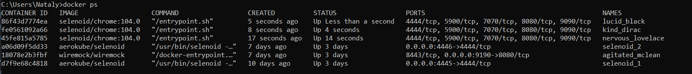

# OtusHomework_4
**Домашнее задание:**
Разворачивание и подключение Selenoid

*Проект содержит следующие тесты:*
- UI-тесты (Java+Selenium)
- API-тесты проверки Backend при помощи RestAssured
- Stub сервер для Backend 

Настройка Stub-сервера
---
Перед запуском тестов необходимо стартануть
[WireMock в docker](https://hub.docker.com/r/wiremock/wiremock):

````docker run -d -p 9190:8080 wiremock/wiremock --verbose````

Stub сервер реализован на Wiremock со следующими endpoint'ами:
- /user/get/{id} для получение оценки пользователя
- /cource/get/all для получения списка курсов
- /user/get/all - для получения списка всех пользователей

К каждому stub написаны тесты на RestAssured.

UI-тесты
---
UI-тесты содержат три теста для сайта https://otus.ru:
- Поиск курсов по заданному фильтру в названии курса (-Dfilter)
- Поиск курса, стартующего раньше всех
- Поиск курса, стартующего позже всех 

Тесты распараллелины на JUnit 4. Количество потоков регулируется в pom.xml для maven-surefire-plugin параметр thread.count,
по умолчанию 3. Также параметр можно задавать при запуске тестов через Maven (-Dthread.count).

По-умолчанию тесты настроены на работу в Chrome 104.0 (параметры browser и browser.version в pom.xml).
Работу на других браузерах и версиях можно регулировать при запуске тестов через Maven (-Dbrowser и -Dbrowser.version)
При этом соответствующие слои браузеров и версий должны быть настроены [browser.json](conf/browsers.json) и подгружены (pull) в образ Selenoid.

Фабрика браузеров для данной версии тестов не поддержана.

Поднятие одного экземпляра Selenoid (на Windows)
---
Если экземпляр Selenoid поднят, то запускаем его командой:
````
docker start selenoid_1 
````
В противном случае поднимаем экземпляр Selenoid (пп.1-5):
1. Создаем сеть
````
docker network create selenoid_1
network docker ls
````
2. Создаем рабочую директорию, например C:\Work\OTUS\Selenoid 
3. В рабочей директории создаем файл [browser.json](conf/browsers.json), в котором настраиваем нужные нам браузеры и версии 
4. Делаем pull образов браузеров из файла [browser.json](conf/browsers.json), например
````
docker pull selenoid/chrome:104.0
docker pull selenoid/chrome:103.0
docker pull selenoid/opera
````
5. Запускаем образ экземпляра Selenoid с указанием рабочей директории
```` 
docker run -d --name selenoid_1 -p 4445:4444 --net=selenoid_1 -v //var/run/docker.sock:/var/run/docker.sock -v C:\Work\OTUS\Selenoid:/etc/selenoid:ro aerokube/selenoid -limit=12 -capture-driver-logs -max-timeout=0h30m0s -container-network=selenoid_1
docker ps
docker logs selenoid_1
````
6. Указываем в тестах по какому адресу будет слушать Selenoid. Для этого в pom.xml
настраиваем параметр     
````
<webdriver.remote.url>http://127.0.0.1:4445/wd/hub</webdriver.remote.url>
````
В capabilities не забываем указать настройки браузера и версии:
````
    DesiredCapabilities capabilities = new DesiredCapabilities();
    capabilities.setCapability("browserName",browser);
    capabilities.setCapability("browserVersion",browserVersion);
    capabilities.setCapability("enableVNC",true);
````
Selenoid поднимет docker-образ для каждого потока выполнения. В docker-образе будет запущен настроенный браузер,
на котором и будут выполняться тесты.
7. Чтобы иметь возможность заглянуть во внутрь контейнера (enableVNC=true) и проконтролировать ход выполнения тестов можно поднять Selenoid UI для одного экземпляра Selenoid. 
Поднятие Selenoid-UI будет рассматриваться в настройке кластера.


Настройка кластера для двух экземпляров Selenoid (на Windows)
---
**Быстрый старт всех компонент для уже поднятого кластера:**
1. Стартуем первый экземпляр Selenoid
````
docker start selenoid_1
````
3. Стартуем второй экземпляр Selenoid
````
docker start selenoid_2 
````
4. Стартуем балансировщик GGR из директории <рабочая_директория>/ggr_config командой:
````
start /b ggr_windows_amd64.exe -guests-allowed -guests-quota "test" -verbose C:\Work\OTUS\Selenoid\ggr_config\quota
````
5. Стартуем модуль GGR-UI из директории <рабочая_директория>/ggr_config командой:
````
start /b ggr-ui_windows_amd64.exe -quota-dir C:\Work\OTUS\Selenoid\ggr_config\quota
````
6. Старутем Selenoid-UI из директории <рабочая_директория>/ggr_config командой:
````
start /b selenoid-ui_windows_amd64.exe --selenoid-uri http://127.0.0.1:8888 -listen ":8090" -allowed-origin "*"
````
8. Стартуем Nginx из директории <рабочая_директория>\nginx-1.22.1\nginx-1.22.1\
````
start nginx
````
7. Проверяем в Диспетчере задач Windows, что все сервисы запущены

8. Проверяем, что все docker-контейнеры работают

9. Проверяем, что Selenoid-UI готов к работе

10. Настраиваем запуск тестов на адрес балансировщика в 3 потока: задаем в pom.xml параметры
````
<browser>chrome</browser>
<browser.version>104.0</browser.version>
<webdriver.remote.url>http://127.0.0.1/wd/hub</webdriver.remote.url>

<thread.count>3</thread.count>
````
11. Запускаем тесты и убеждаем, что они отрабатывают в три потока




---
**Настройка кластера с нуля:**

1. Поднимаем первый экземпляр Selenoid 
как показано в разделе "Поднятие одного экземпляра Selenoid" (пп.1-5). 
2. Поднимаем второй экземпляр Selenoid
````
docker network create selenoid_2
docker run -d --name selenoid_2 -p 4446:4444 --net=selenoid_2 -v //var/run/docker.sock:/var/run/docker.sock -v C:\Work\OTUS\Selenoid:/etc/selenoid:ro aerokube/selenoid -limit=12 -capture-driver-logs -max-timeout=0h30m0s -container-network=selenoid_2
docker ps
docker logs selenoid_2
````
3. При помощи утилиты htpasswd генерируем файл [users.htpasswd](conf/users.htpasswd) с логином и паролем (test/test-password) и кладем его в рабочую директорию рядом с файлом [browser.json](conf/browsers.json)
Варианты генерации:
- если установлена утилита, то командой
````
htpasswd -bc C:\Work\OTUS\Selenoid\users.htpasswd test test-password
````
- при помощи онлайн-сервиса: https://htmlweb.ru/service/htpasswd.php
- скопировать [уже существующий файл](conf/users.htpasswd)

4. Настраиваем квоты.
- В рабочей директории создадим папку \ggr_config\quota\ и в ней файл, 
который будет называться по имени пользователя, в нашем случае это [test.xml](conf/ggr_config/quota/test.xml).
- Проверяем, что правильно указаны порты для selenoid_1 и selenoid_2. 
- Параметр count будет указывать на количество квот, т.е. количества сессий браузеров доступных для одновременной работы.

5. [Скачиваем бинарник балансировщика GGR](https://github.com/aerokube/ggr/releases), кладем его в директорию \ggr_config
и запускаем его работать в фоне командой:
````
start /b ggr_windows_amd64.exe -guests-allowed -guests-quota "test" -verbose C:\Work\OTUS\Selenoid\ggr_config\quota
````
6. [Скачиваем бинарник модуля GGR-UI](https://github.com/aerokube/ggr-ui/releases), кладем его в директорию \ggr_config
   и запускаем его работать в фоне командой:
````
start /b ggr-ui_windows_amd64.exe -quota-dir C:\Work\OTUS\Selenoid\ggr_config\quota
````
Единственная задача модуля GGR-UI - собирать квоты для Selenoid-UI.

7.  [Скачиваем бинарник Selenoid-UI](https://github.com/aerokube/selenoid-ui/releases), кладем его в директорию \ggr_config
    и запускаем его работать в фоне командой:
````
start /b selenoid-ui_windows_amd64.exe --selenoid-uri http://127.0.0.1:8888 -listen ":8090" -allowed-origin "*"
````
Selenoid-UI будет подключаться к GGR-UI через порт 8888, а GGR-UI подключается к GGR через файлик [test.xml](conf/ggr_config/quota/test.xml). 
GGR подключается к экземпляры Selenoid через порты, которые мы указали в конфиге.

Проверяем в браузере по адресу http://127.0.0.1:8080

8. Поднимаем proxy. У proxy единственная задача - помогать пользователям взаимодействовать с Selenoid-UI,
   а все тесты отправлять на балансировщик.
- [Скачиваем бинарник Nginx](https://nginx.org/ru/download.html), распаковываем и кладем его в рабочую директорию.
- Задаем конфигурационные настройки в файле  [<рабочая_директория>\nginx-1.22.1\nginx-1.22.1\conf\nginx.conf](conf/nginx.conf)
- Запускаем из рабочей директории командой:
````
start nginx
````
Больше об nginx [тут](https://nginx.org/ru/docs/windows.html)
- Проверяем в браузере http://localhost должен средиректить на Selenoid-UI, для которого доступно создание сессий.
9. Дальнейшие настройки совпадают с пп.7-11 для быстрого старта

